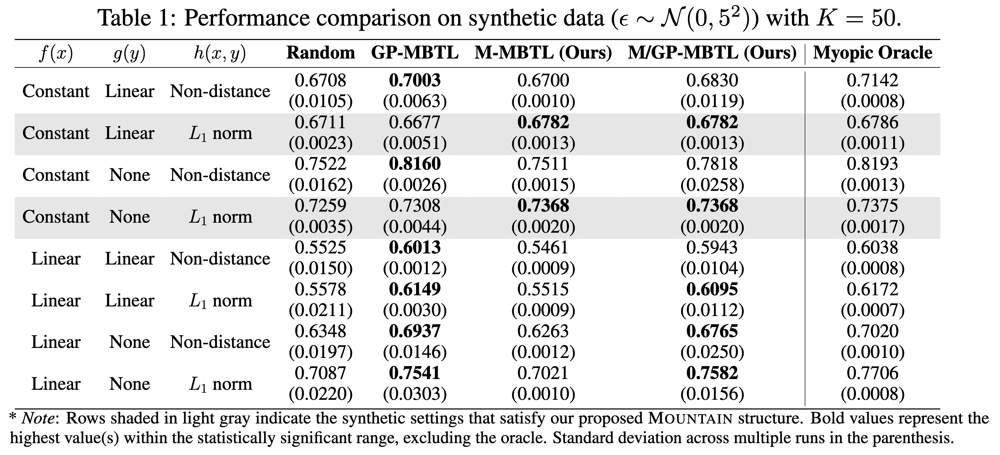
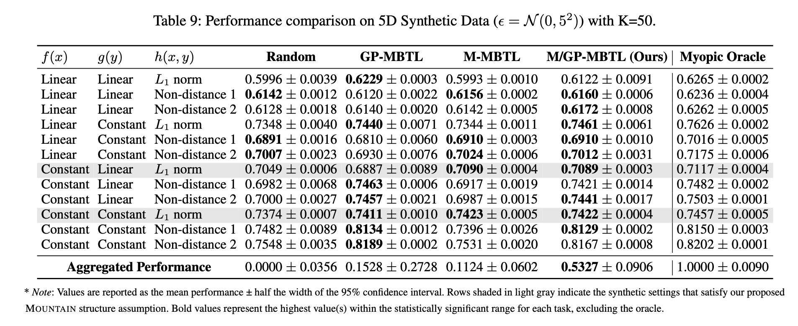
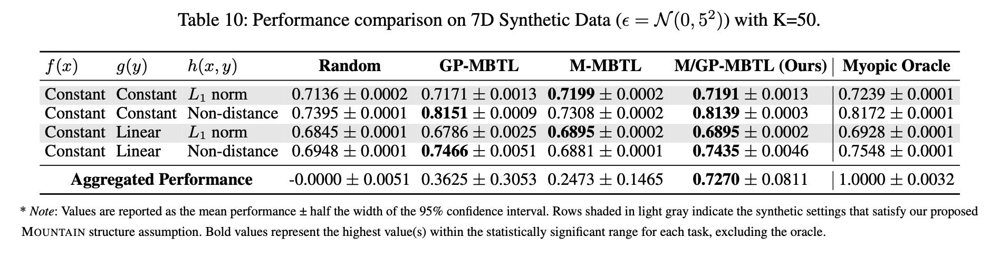
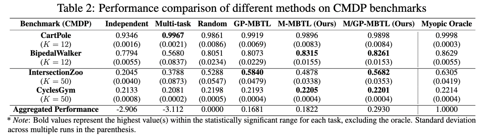

# Structure Detection for Contextual Reinforcement Learning

Codebase for "Structure Detection for Contextual Reinforcement Learning (Under Review)"


## Directory

```
SD-MBTL/
├── data/                   # Data
├── figures/                # Figures
├── tables/                 # Tables
├── algs.py                 # Algorithms
├── utils.py                # Utility functions
├── main.py                 # Main function
├── environment.yml         # Environment file
├── README.md               # This file
├── plot_figure.ipynb       # Jupyter notebook for plotting figures
├── s-run-main-synt.sh      # Shell script for running main.py with 3d synthetic data
├── s-run-main-synt5d.sh    # Shell script for running main.py with 5d synthetic data
├── s-run-main-synt7d.sh    # Shell script for running main.py with 7d synthetic data
├── s-run-main.sh           # Shell script for running main.py with real-world data
└── LICENSE                 # License

```
## Installation
```
conda env create -f environment.yml
```

## Training RL policies and evaluating on CMDP

We consider two types of tasks: synthetic and real-world tasks. The synthetic tasks are generated using the `gen_synthetic_data.ipynb`, while the real-world tasks are generated using four environments under `envs/`.

### Synthetic tasks
The synthetic tasks are generated using the `gen_synthetic_data.ipynb` notebook. The notebook generates the data and saves it in the `data/` directory. You can run the notebook to generate the data.

### Real-world tasks
The real-world tasks are generated using the following environments:
- [CartPole and BipedalWalker](./envs/control-tasks/)
- [CyclesGym](./envs/cyclesgym/)
- [IntersectionZoo](./envs/intersectionzoo/)

### Download the data

You can download the synthetic and real-world datasets from the following links:

- [Data (Synthetic and Real-World)](https://drive.google.com/file/d/1Xna4P9ddZETb46ai0T6vg08eVwZ-oloQ/view?usp=sharing)

After downloading the data, unzip it and place the contents in the `data/` directory.

## Run SD-MBTL and baselines

### Run SD-MBTL and baselines in synthetic tasks (CartPole, BipedalWalker, IntersectionZoo, and CyclesGym)

3 dimensional tasks:
```bash
bash s-run-main-synt.sh
```

5 dimensional tasks:
```bash
bash s-run-main-synt5d.sh
```

7 dimensional tasks:
```bash
bash s-run-main-synt7d.sh
```

### Run SD-MBTL and baselines in real-world tasks (CartPole, BipedalWalker, IntersectionZoo, and CyclesGym)

```bash
bash s-run-main.sh
```

## Results

You can find the results in the `tables` and `figures` directories. The results are generated by running the `plot_figure.ipynb` notebook.
### Synthetic tasks
3 dimensional

5 dimensional

7 dimensional

### Real-world tasks
The aggregated performance scales each MBTL-based algorithm’s performance between 0 and 1—reflecting how much it outperforms the Random baseline and how closely it approaches the Myopic Oracle—averaged across four benchmarks.



## License
This project is licensed under the MIT License. See the [LICENSE](LICENSE) file for details. Each benchmark environment is licensed under its own license. Please refer to the respective repositories for more information.

## Acknowledgements
This codebase is built upon the following repositories:
- [MBTL (NeurIPS 2024)](https://github.com/jhoon-cho/MBTL)

## Cite
Coming soon

## Contact
This is anonymous codebase for the paper "Structure Detection for Contextual Reinforcement Learning (Under Review)". The code is not intended for public release. If you are interested in the code or have any questions, please contact the authors after the review process is completed.
